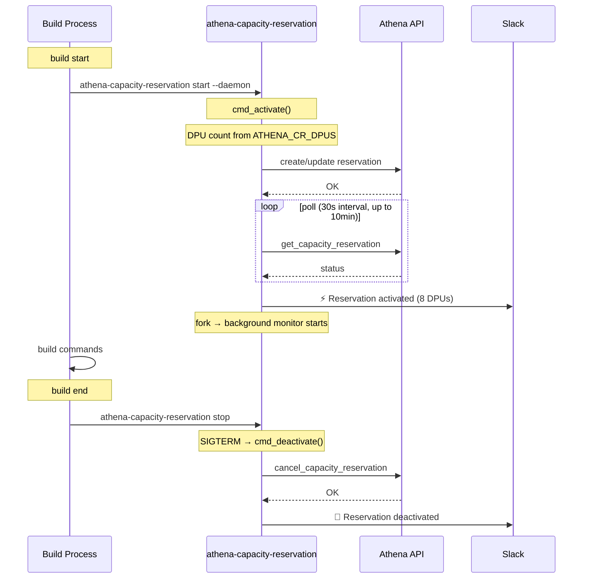
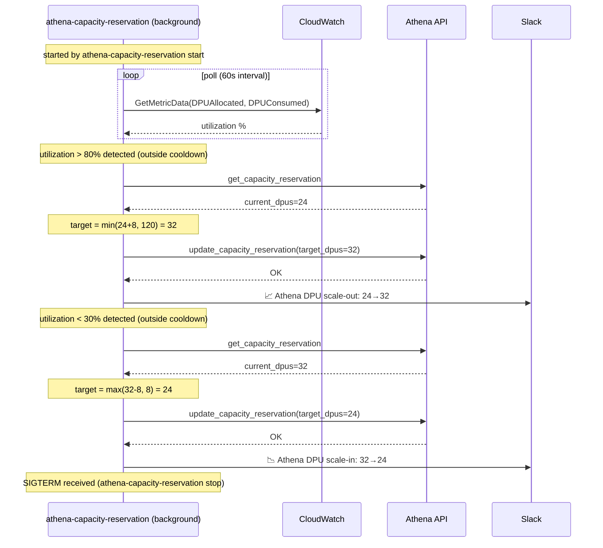

# Athena Capacity Reservation Management

## Sequence Diagrams

### Normal Flow (activate → build → deactivate)

### Autoscale Flow (DPU adjustment during build)

The capacity monitor runs in the background during the build phase, polling CloudWatch DPU utilization and scaling out/in accordingly.

