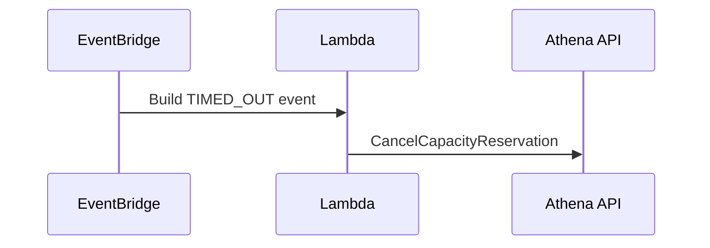
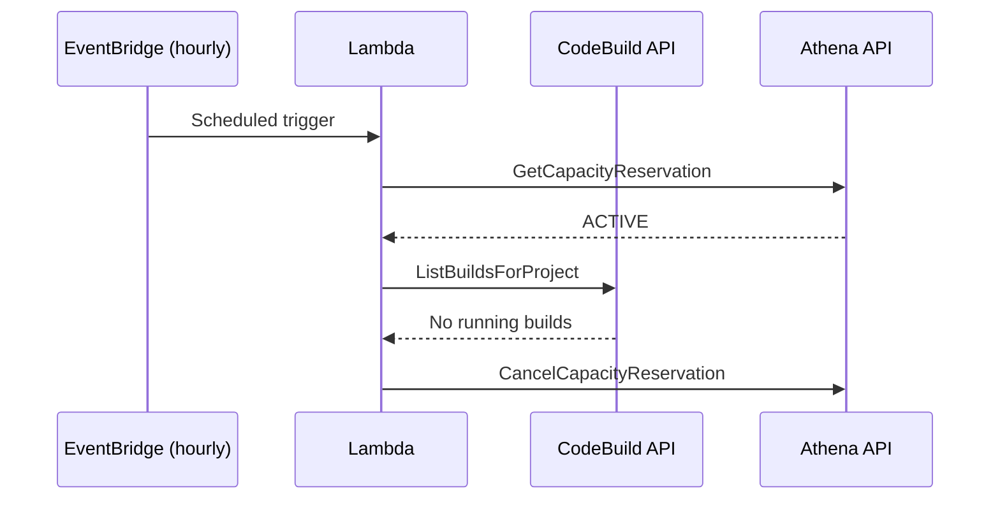

# Fallback Strategies

This tool handles reservation lifecycle errors internally (Slack notifications, retries, graceful degradation). However, some failure modes require external safeguards that are outside the scope of this tool.

## Timeout Fallback

If `athena-capacity-reservation stop` fails or the build process crashes before `stop` is called, the reservation remains active and continues to incur costs. CI-level timeout handling (e.g. CodeBuild `post_build.finally`) cannot reliably catch all failure modes such as OOM kills or spot terminations.

Recommended: use EventBridge to detect build timeout events and trigger a Lambda function that deactivates the reservation.

### EventBridge + Lambda example

The EventBridge rule should match CodeBuild state-change events where the build status is `TIMED_OUT`, then invoke a Lambda function that cancels the capacity reservation.

## Scheduled Cleanup Fallback

Even with `finally` blocks, edge cases can leave reservations active:

- CI runner killed by infrastructure (OOM, spot termination)
- Network partition during `stop`
- Bug in the tool itself

Recommended: set up a scheduled job (e.g. EventBridge + Lambda, cron) that periodically checks whether any CI job is still using the reservation. If no job is running, deactivate it.

### EventBridge + Lambda example

The Lambda function should:

1. Call `athena:GetCapacityReservation` for known reservation names
2. Check whether any CI job (e.g. CodeBuild build) is currently running that uses the reservation
3. If `ACTIVE` and no associated job is running, cancel the reservation
4. Send a Slack notification for visibility

This acts as a safety net regardless of how the build process fails.
